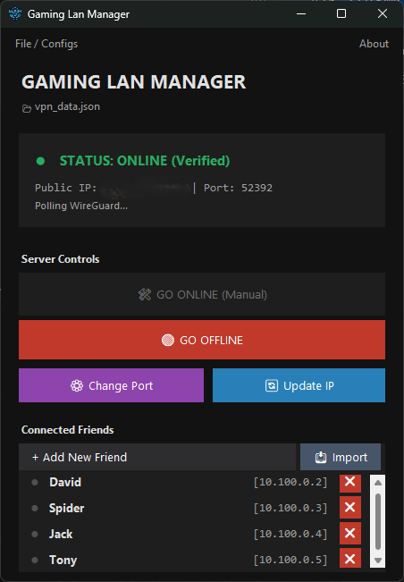
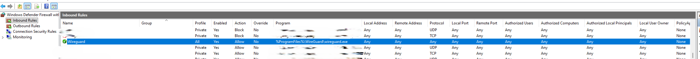

# 🎮 Gaming LAN Manager (Midnight Obsidian)


[](https://ko-fi.com/SovereignBit)

**The ultimate tool for creating secure, split-tunnel WireGuard VPNs for gaming with friends.**

<p align="center">
  
  <br>
  <em>Midnight Obsidian UI - Elastic, Secure, and Manual.</em>
</p>

## 🚀 Why use this?
Setting up a VPN for gaming usually involves complex config files, command lines, or expensive paid software (like Hamachi).

**Gaming LAN Manager** solves this by:
1.  **Automating Keys:** Generates secure WireGuard Public/Private keys instantly.
2.  **Split-Tunneling:** Only game traffic (`10.100.0.x`) goes through the VPN. Your normal internet stays fast.
3.  **No "Spyware":** It's a simple Python script. No accounts, no ads, no bloat.
4.  **Friend Management:** Create, export, and ban users with one click.

## ✨ New in v2026.41
* **Elastic layout:** Fixed button areas and a scrollable friend list that expands properly.
* **ADDED:** Scrollbar auto-appears only when needed.
* **Enhanced dark theme:** Consistent colors and better spacing.
* **Enhanced dark dialogs:** Icons, better text wrapping, and improved button layouts.
* **New Features:** Added port change and manual IP update features with user-friendly dialogs.

---

## 📦 Installation & Requirements

### Prerequisites
1.  **[WireGuard for Windows](https://www.wireguard.com/install/)** must be installed.
2.  **Router Config:** You must manually forward **UDP Port 52392** (or your custom port) to your PC's local IP address.

### Option A: Run the EXE (Recommended)
1.  Download `GamingLAN.exe` from the Releases page.
2.  Double-click to run.
3.  *Note: You do not need Administrator rights to run the manager, only to activate WireGuard itself.*

### Option B: Run from Source
If you have Python installed and want to run the script directly:
```powershell
# No external requirements needed (Standard Libs only)
python vpn_universal.py

```

---

## ⚠️ Firewall Configuration (Crucial)

For your friends to connect to you, **Windows Firewall must allow inbound traffic** to WireGuard.

You have two options (Option A is recommended):

### Option A: Allow the WireGuard Application (Easiest)

1. Open **Windows Defender Firewall with Advanced Security**.
2. Click **Inbound Rules** > **New Rule...**
3. Select **Program** and browse to: `C:\Program Files\WireGuard\wireguard.exe`
4. Select **Allow the connection**.
5. Check **Private** (and Public if you are on a public network).
6. Name it "WireGuard Allow".

### Option B: Allow the Specific Port

If you prefer to only open the specific port:

1. Create a **New Rule** > **Port**.
2. Select **UDP** and enter the port from the app (Default: `52392`).
3. Allow the connection.

<p align="center">

</p>

---

## 🎮 How to Play

### For the HOST (You)

1. Open the app and click **+ Add New Friend**.
2. Enter their name (e.g., "Dave").
3. The app creates a file: `Friend_Configs/Dave_VPN.conf`.
4. **Send this file to Dave** (Discord, Email, etc.).
5. Click **"🛠 GO ONLINE"**.
6. *Follow the prompt:* Open the WireGuard app, click **Activate** on the `HOST_THIS_PC` tunnel.

### For the CLIENT (Your Friend)

1. Install [WireGuard](https://www.wireguard.com/install/).
2. Open WireGuard and click **"Import Tunnel(s) from File"**.
3. Select the `Dave_VPN.conf` file you sent them.
4. Click **Activate**.
5. **Game Time:** You can now see each other's LAN lobbies (IPs will be `10.100.0.x`).

---

## 🔨 How to Build (Create your own EXE)

If you want to package the app yourself (e.g., to share with friends or after modifying code), use **PyInstaller**.

1. **Install PyInstaller:**
```powershell
pip install pyinstaller

```


2. **Prepare Folder:**
Ensure you have `gaminglan.ico` and `clean_icon.png` in the same folder as the script.
3. **Run the Build Command:**
Open a terminal in the project folder and run this single command:
```powershell
python -m PyInstaller --noconsole --onefile --icon="gaminglan.ico" --add-data "gaminglan.ico;." --add-data "clean_icon.png;." --name="GamingLAN" vpn_universal.py

```


**What do these flags do?**
* `--noconsole`: Hides the black command prompt window.
* `--onefile`: Bundles everything into a single `.exe` file.
* `--add-data`: Packs your icons *inside* the EXE so they never go missing.


---

## 🛑 Troubleshooting

| Issue | Solution |
| --- | --- |
| **Status won't turn "ONLINE"** | The app checks if `wireguard.exe` is running. Open the WireGuard app and verify the tunnel is "Active". |
| **Friend can't connect** | Double-check your Router Port Forwarding (**UDP 52392**). Ensure Windows Firewall isn't blocking WireGuard. |
| **"Charmap" / Encoding Error** | You are using an old version. Update to **Onyx Edition (v2026.41)** which supports UTF-8 Emojis in config files. |
| **Config file missing** | Check the `Friend_Configs` folder. If WireGuard was missing when you created it, the app will auto-repair it next time you launch. |
| **"File Not Found" (Building)** | Ensure `gaminglan.ico` and `clean_icon.png` are in the folder before running the PyInstaller command. |

## 📜 License

This project is open-source (MIT). Feel free to fork, mod, and share.

---

**Credits:**

* **Lead Developer:** SovereignBit
* **Co-Pilot:** Gemini AI (Google)

*Built with Python & Tkinter. Powered by WireGuard.*

```

```