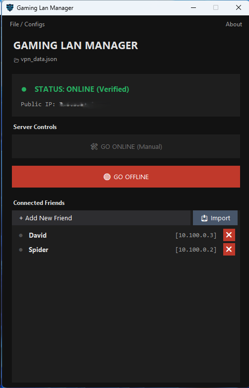

# 🎮 Gaming LAN Manager (Onyx Edition)


**The ultimate tool for creating secure, split-tunnel WireGuard VPNs for gaming with friends.**

<p align="center">
  
  <br>
  <em>Midnight Obsidian UI - Secure, Manual, and Clean.</em>
</p>

## 🚀 Why use this?
Setting up a VPN for gaming usually involves complex config files, command lines, or expensive paid software (like Hamachi).

**Gaming LAN Manager** solves this by:
1.  **Automating Keys:** Generates secure WireGuard Public/Private keys instantly.
2.  **Split-Tunneling:** Only game traffic (`10.100.0.x`) goes through the VPN. Your normal internet stays fast.
3.  **No "Spyware":** It's a simple Python script. No accounts, no ads, no bloat.
4.  **Friend Management:** Create, export, and ban users with one click.

## ✨ Features (Onyx Edition)
* **🛡️ Secure Manual Control:** No UPnP. You decide when the port is open for maximum security.
* **🌑 Midnight Obsidian UI:** A true dark theme (custom title bar, menus, and popups) that is easy on the eyes.
* **📂 Auto-Sync & Import:** Drop a friend's `.conf` file in the folder, and the app imports it automatically on startup.
* **⚡ Strict Status Check:** The "ONLINE" indicator **only** turns green if the WireGuard tunnel is verified to be active.
* **🔧 Auto-Repair:** Automatically fixes config files if WireGuard wasn't installed when you first created them.
* **✅ Non-Admin Mode:** Runs safely as a standard user (prompts you to use the WireGuard app for the heavy lifting).
* **UTF-8 Support:** Full support for emojis and special characters in names/configs.

---

## 📦 Installation & Requirements

### Prerequisites
1.  **[WireGuard for Windows](https://www.wireguard.com/install/)** must be installed.
2.  **Router Config:** You must manually forward **UDP Port 51820** to your PC's local IP address.

### Option A: Run the EXE (Recommended)
1.  Download `GamingLAN.exe` from the Releases page.
2.  Double-click to run.
3.  *Note: You do not need Administrator rights to run the manager, only to activate WireGuard itself.*

### Option B: Run from Source
If you have Python installed and want to run the script directly:
```powershell
# No external requirements needed for Onyx Edition (Standard Libs only)
python vpn_universal.py

```

---

## 🔨 How to Build (Create your own EXE)

If you want to package the app yourself (e.g., to share with friends or after modifying code), use **PyInstaller**.

1. **Install PyInstaller:**
```powershell
pip install pyinstaller

```


2. **Prepare Folder:**
Ensure you have `gaminglan.ico` and `clean_icon.png` in the same folder as the script.
3. **Run the Build Command:**
Open a terminal in the project folder and run this single command:
```powershell
python -m PyInstaller --noconsole --onefile --icon="gaminglan.ico" --add-data "gaminglan.ico;." --add-data "clean_icon.png;." --name="GamingLAN" vpn_universal.py

```


**What do these flags do?**
* `--noconsole`: Hides the black command prompt window so it looks like a native app.
* `--onefile`: Bundles everything into a single `.exe` file (instead of a folder).
* `--add-data`: Packs your icons *inside* the EXE so they never go missing.
* `--icon`: Sets the file icon in Windows Explorer.


4. **Locate App:**
Your new `GamingLAN.exe` will appear in the `dist` folder.

---

## 🎮 How to Play

### For the HOST (You)

1. Open the app and click **+ Add New Friend**.
2. Enter their name (e.g., "Dave").
3. The app creates a file: `Friend_Configs/Dave_VPN.conf`.
4. **Send this file to Dave** (Discord, Email, etc.).
5. Click **"🛠 GO ONLINE"**.
6. *Follow the prompt:* Open the WireGuard app, import `HOST_THIS_PC.conf` (created next to the exe), and click **Activate**.

### For the CLIENT (Your Friend)

1. Install [WireGuard](https://www.wireguard.com/install/).
2. Open WireGuard and click **"Import Tunnel(s) from File"**.
3. Select the `Dave_VPN.conf` file you sent them.
4. Click **Activate**.
5. **Game Time:** You can now see each other's LAN lobbies (IPs will be `10.100.0.x`).

---

## 🛠️ Advanced Features

### Manual Import

If you reinstall Windows or move to a new PC:

1. Copy your `vpn_data.json` file to keep your list.
2. **OR:** Just drop your old `.conf` files into the `Friend_Configs` folder. The app will auto-detect and import them on the next launch.
3. **OR:** Use the **"📥 Import"** button in the app to manually select a config file.

### Banning/Kicking Players

1. Click the **❌** button next to a friend's name.
2. Confirm the ban.
3. **Important:** You must go to the WireGuard app and "Deactivate" then "Activate" your tunnel to enforce the ban immediately.

---

## 🛑 Troubleshooting

| Issue | Solution |
| --- | --- |
| **Status won't turn "ONLINE"** | The app checks if the WireGuard service is running. Open the WireGuard app and verify the tunnel is "Active". |
| **Friend can't connect** | Double-check your Router Port Forwarding (**UDP 51820**). Ensure Windows Firewall isn't blocking WireGuard. |
| **"Charmap" / Encoding Error** | You are using an old version. Update to **Onyx Edition (v2026.40+)** which supports UTF-8 Emojis in config files. |
| **Config file missing** | Check the `Friend_Configs` folder. If WireGuard was missing when you created it, the app will auto-repair it next time you launch. |
| **"File Not Found" (Building)** | Ensure `gaminglan.ico` and `clean_icon.png` are in the folder before running the PyInstaller command. |

## 📜 License

This project is open-source. Feel free to fork, mod, and share.

---

*Built with Python & Tkinter. Powered by WireGuard.*
